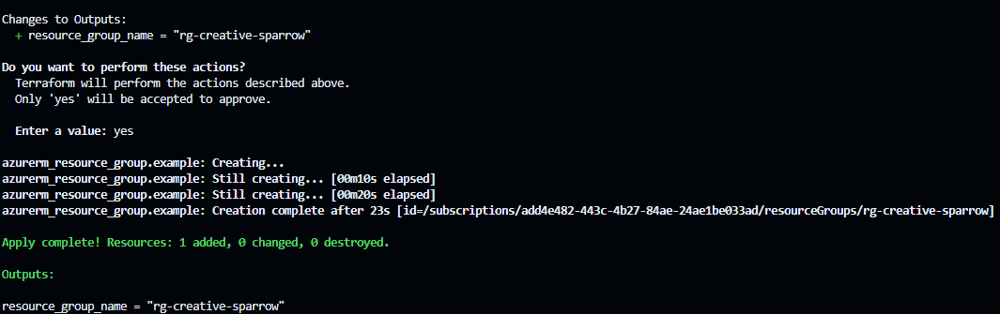
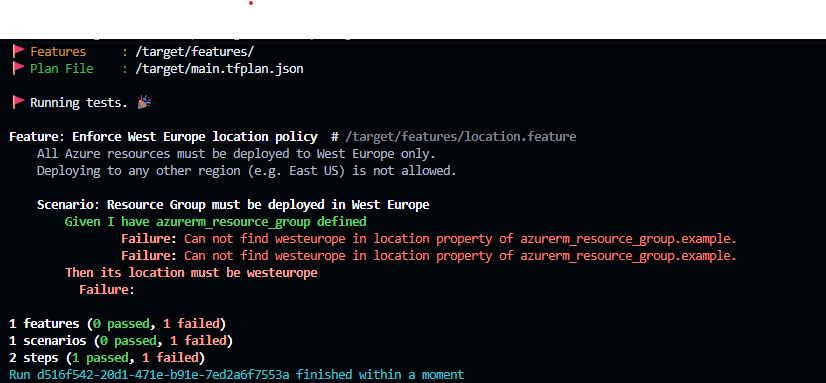
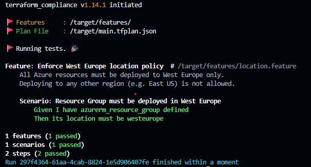
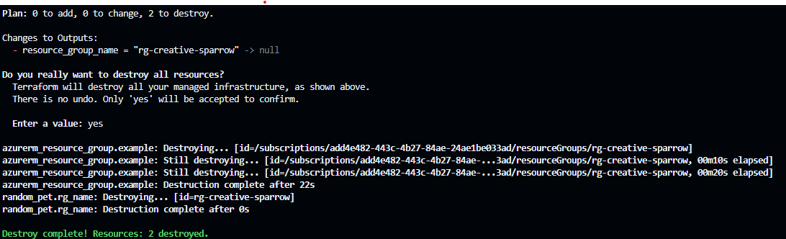

# RGCreateDestroy using Terraform, Docker & Azure

This project demonstrates how to create and destroy an Azure Resource Group using Terraform, with compliance checks enforced via terraform-compliance running inside Docker — ensuring infrastructure meets policy requirements before anything is deployed.

## GitHub

https://github.com/marius2347/RGCreateDestroy-using-Terraform-Docker-in-Azure

## Project Structure

```
Project21/
├── features/
│   └── location.feature      # Compliance rule: location must be West Europe
├── main.tf                   # Resources: resource group + random name
├── variables.tf              # Input variables (location, name prefix)
├── outputs.tf                # Outputs: resource group name
├── providers.tf              # Providers: azurerm ~>4.0, random ~>3.0
├── main.tfplan               # Generated binary plan
└── main.tfplan.json          # Generated JSON plan (used by compliance)
```

## Technologies Used

- **Terraform** — Infrastructure as Code tool to define and deploy Azure resources
- **Azure** — Cloud provider (Azure Resource Manager via `azurerm` provider)
- **Docker** — Runs terraform-compliance in an isolated container
- **terraform-compliance** — BDD-style compliance checks against Terraform plans

## Compliance Rule

The `features/location.feature` file enforces that all Azure resources must be deployed to **West Europe** only. Any plan targeting another region (e.g. East US) will fail the check before `apply` is run.

```gherkin
Feature: Enforce West Europe location policy
  Scenario: Resource Group must be deployed in West Europe
    Given I have azurerm_resource_group defined
    Then its location must be westeurope
```

## Workflow

```
terraform plan → convert to JSON → compliance check → terraform apply
```

Compliance sits between `plan` and `apply` — it is the safety gate before anything touches Azure.

## Step by Step

### 1. Initialize Terraform
```bash
terraform init
```

### 2. Generate the plan
```bash
terraform plan -out main.tfplan
```

### 3. Convert plan to JSON
```bash
terraform show -json main.tfplan > main.tfplan.json
```

### 4. Pull the compliance Docker image (once)
```bash
docker pull eerkunt/terraform-compliance
```

### 5. Run compliance check
```bash
docker run --rm -v "${PWD}:/target" -it eerkunt/terraform-compliance -f /target/features -p /target/main.tfplan.json
```

### 6. Apply (only after compliance passes)
```bash
terraform apply "main.tfplan"
```

### 7. Destroy resources when done
```bash
terraform destroy
```

## Screenshots

### Terraform Create


### Terraform Compliance Failed (wrong region)


### Terraform Compliance Success (West Europe)


### Terraform Destroy


## Tags Policy

This Azure subscription enforces a mandatory tags policy. All resources must include:

```hcl
tags = {
  Environment = "devtest"
  Owner       = "marius"
  Project     = "ProjectTerraform"
}
```

## Contact

**Marius** — mariusc0023@gmail.com
